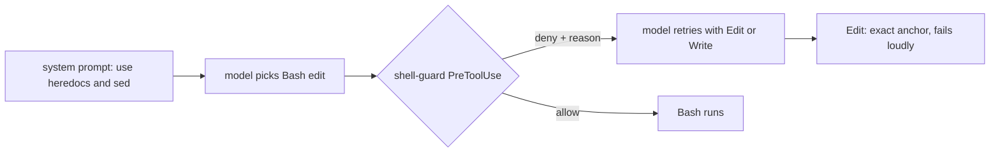

# shell-guard evaluation (2026-09-12, Claude Code 2.1.267, M4 Pro)

Evidence behind `hooks/shell-guard.sh` and the "File changes" and "Python" sections of CLAUDE.md.

## At a glance

**TL;DR.** Desktop sessions in bypass-permissions mode carry a system-prompt block that tells the model to make file changes with heredocs, `sed`, or short scripts instead of the Edit and Write tools, and to run Python bare; CLAUDE.md prose loses to it. In real transcripts those shell paths errored 4-38% of the time against 0-1.5% for Edit, and 33 of 44 inline-python edits had no guard against a silently missed anchor. A PreToolUse(Bash) hook now denies each shell form and names the native replacement; a two-arm headless trial shows it converts every shell attempt into a native edit at the same cost and turn count.

**General case.** A harness system prompt outranks CLAUDE.md. A behaviour you want to override from the system prompt needs a mechanism the harness enforces, which for tool use is a PreToolUse hook (exit 2, stderr goes to the model; per the [hooks reference](https://code.claude.com/docs/en/hooks.md), "a hook that exits with code 2 stops the tool call before permission rules are evaluated", and bypass mode is documented as skipping prompts only). **This instance.** The block reads:

```
While bypass permissions mode is active:
Do your work through the Bash tool wherever it can accomplish the job: read files with cat, head, or sed -n,
search with grep and find, and make file changes with sed, heredocs, or short scripts, rather than using the
dedicated Read, Edit, or Write tools. Fall back to a dedicated tool only when Bash genuinely cannot do the job.
```

It is present in the desktop app's interactive session and absent from headless `claude -p` sessions (probe below). No official doc describes it; the [tools reference](https://code.claude.com/docs/en/tools-reference.md) documents Edit as exact string replacement and Write as create-or-overwrite with no permission-mode condition. `CLAUDE_CODE_SIMPLE_SYSTEM_PROMPT=1` (set in settings env) shortens the prompt and tool descriptions but keeps hooks, MCP, and CLAUDE.md ([env vars](https://code.claude.com/docs/en/env-vars.md)); `CLAUDE_CODE_SIMPLE=1` is the separate bare mode that disables hooks, skills, plugins, and CLAUDE.md, and is not set.



Caption: the hook sits between the model's choice and execution; the deny text is the only feedback the model needs.

## Census of real transcripts (`evals/edit-tool-census.py`)

`uv run edit-tool-census.py ~/.claude/projects/<project>/*.jsonl`. Errors = tool results flagged `is_error`. Median chars = size of the tool input. Guarded = an inline python edit that asserts, raises, or counts its anchor.

fenchem-lp (2 sessions, 172 MB):

| mechanism | calls | errors | err% | median chars | guarded |
|---|---|---|---|---|---|
| Edit | 16 | 0 | 0.0% | 499 | 100% |
| Write | 30 | 0 | 0.0% | 6,363 | 100% |
| python inline file-write | 44 | 2 | 4.5% | 2,501 | 25% |
| python inline (any) | 56 | 2 | 3.6% | 1,856 | 20% |
| uv run | 18 | 1 | 5.6% | 1,168 | |
| cat heredoc into file | 13 | 3 | 23.1% | 1,370 | |
| sed -i / perl -i | 8 | 3 | 37.5% | 707 | |

nix-config (all sessions):

| mechanism | calls | errors | err% | median chars |
|---|---|---|---|---|
| Edit | 200 | 3 | 1.5% | 675 |
| Write | 38 | 1 | 2.6% | 4,278 |
| python inline file-write | 12 | 0 | 0.0% | 702 |
| cat heredoc into file | 27 | 2 | 7.4% | 1,092 |
| sed -i / perl -i | 19 | 3 | 15.8% | 652 |
| echo/printf append | 7 | 0 | 0.0% | 847 |

Reading of the table: an Edit carries the anchor and the replacement and nothing else (499 chars median); the equivalent python heredoc carries the same strings plus boilerplate and escaping (2,501 chars, 5x) and, unguarded, reports "ok" when `str.replace` matched nothing. Edit fails loudly on a missed anchor and asks for a re-read. The error rate of `sed -i` is BSD-vs-GNU flag drift on macOS.

## Two-arm trial (`evals/shell-guard-trial.py`)

Three organic prompts (edit a config value, append a README section, write and run a script), fresh project dir per run, `claude -p --output-format json --dangerously-skip-permissions --model sonnet`, 2 runs per cell. Arm off = the hook's own switches exported. Outcome = expected file state; mechanism counts come from the run's own transcript. `claude plugin eval` (official, with/without-plugin ablation) needs Claude Code 2.1.269+ and is early-access on 2.1.267, so this runner is the documented alternative ([headless](https://code.claude.com/docs/en/headless.md)); the same cases port to `evals/<case>/prompt.md` plus `tool_used` graders once it is enabled.

Plain headless (no bypass block): both arms used Edit/Write and `uv run` in 12/12 runs, 0 denials. The hook is inert when the prompt does not steer toward Bash.

With the bypass block appended via `--append-system-prompt` (`--steer-bash`), reproducing the desktop condition:

| case | arm | success | turns | seconds | cost USD | native edits/run | shell edits/run | denials/run |
|---|---|---|---|---|---|---|---|---|
| pantry-api | off | 2/2 | 3 | 14.3 | 0.18 | 1 | 0 | 0 |
| pantry-api | on | 2/2 | 3 | 12.2 | 0.18 | 1 | 0 | 0 |
| lineups | off | 2/2 | 4.5 | 16.4 | 0.15 | 0 | 1 | 0 |
| lineups | on | 2/2 | 4.5 | 16.0 | 0.15 | 1 | 0.5 | 0.5 |
| fieldnotes | off | 2/2 | 4 | 19.4 | 0.15 | 0.5 | 0.5 | 0 |
| fieldnotes | on | 2/2 | 4.5 | 22.2 | 0.16 | 1 | 0.5 | 0.5 |

Reading: under the steering block the off arm appended the README with `echo >>` or a heredoc in 2/2 runs and wrote the script with a heredoc in 1/2. The on arm attempted the same shell edit in 1/2 runs per case, was denied once, and finished with Edit or Write every time. Cost and turns are within noise; a denial costs one round trip. Success was 6/6 in both arms on these small tasks, so the hook's payoff is the error and silent-no-op classes in the census, not task completion on toy edits.

Probe: `claude -p` asked to quote any system-prompt sentence containing "bypass permissions mode" replied NONE under both `CLAUDE_CODE_SIMPLE_SYSTEM_PROMPT=1` and `=0`; the block is a desktop interactive-session addition, not a function of that flag.

## Edit batching (`evals/edit-batching-census.py`)

Claude Code stores each content block of one assistant message as its own transcript line sharing `message.id`, and under tool streaming the lines of one batched response interleave with tool results, so the census merges by id before counting.

| project | Edit calls | messages with 2+ Edits | Edits in serial single-Edit chains | longest chain | replace_all used |
|---|---|---|---|---|---|
| nix-config | 229 | 18 (42 Edits) | 104 (45%) | 8 | 5 |
| fenchem-lp | 16 | 2 (16 Edits) | 0 | 0 | 0 |

Each turn in a chain is one round trip, about 2k tokens of context at the calibration in search-eval.md. Two Edits to one file in one response work in the harness (verified in this session). `hooks/edit-batch-nudge.sh`, PostToolUse(Edit), reads the session transcript and, when this Edit is the second or later consecutive turn whose only tool call is one Edit, returns `additionalContext` naming the batch form. It fired on the author's own serial edits while being wired. A human prompt or any other tool call resets the run. `BATCH_NUDGE_OFF=1` disables it. `hooks/edit-batch-nudge-test.sh` covers nine transcript shapes and runs as `unit-edit-batch-nudge`.

## What is installed

- `~/.claude/hooks/shell-guard.sh` PreToolUse(Bash). Groups and switches: `UV_GUARD_OFF=1` (bare python/pip/venv to uv), `EDIT_GUARD_OFF=1` (inline python file writes, `sed -i`/`perl -i`, heredoc into a file, `echo`/`printf` into a file, to Edit/Write), `TOOL_GUARD_OFF=1` (`cat`, `sed`, `find`, `perl`, `awk -i` to `bat -pp --line-range`, `rg -r`, `fd`, `jq`, `sg`). Heredoc bodies are stripped before matching, so text inside a document never reads as a command. Works on BSD and GNU userlands (table test runs under `PATH=/usr/bin:/bin` and in the nix sandbox).
- `hooks/shell-guard-test.sh`: 68-row allow/deny table; `just check` runs it as `unit-shell-guard`.
- `claude.nix`: `claudeBashGuards` lists the Bash guards; the seed and the `claudeHooksAssert` activation add a missing guard to the live settings.json on every switch, additively by command path.
- CLAUDE.md: "File changes" section and the uv line in "Python" carry the positive form; the hook carries the enforcement.

Rerun: `uv run modules/home/claude/evals/shell-guard-trial.py --steer-bash --runs 2 --model sonnet --out /tmp/trial.json` (about 4 minutes, 12 runs, ~1 USD on sonnet). Census: `uv run modules/home/claude/evals/edit-tool-census.py ~/.claude/projects/<encoded-cwd>/*.jsonl` on one workspace at a time.
